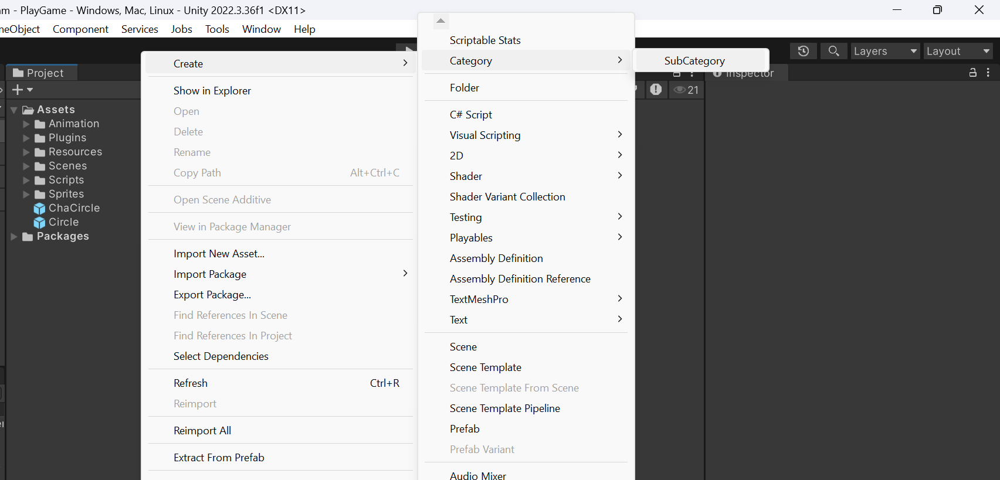
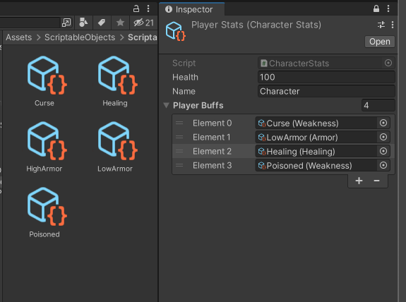
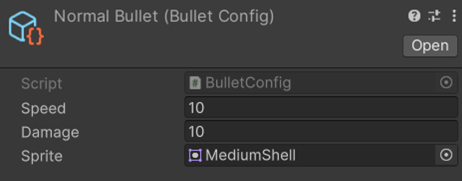
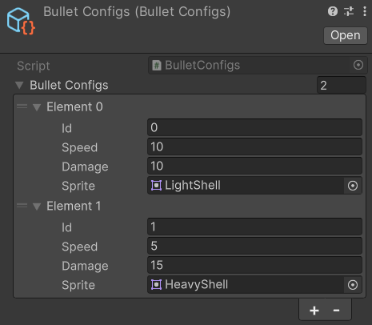

# Buổi 6:  ScriptableObject Configuration & Save Load

## 1. Giới thiệu về ScriptableObject
Trong quá trình phát triển game, các nhà lập trình thường phải đối mặt với bài toán quản lý dữ liệu.
Từ các chỉ số quái cho đến chỉ số nhân vật, màn chơi. Việc tạo lớp chứa dữ liệu và gắn vào GameObject trên Scene là không tối ưu, vì dữ liệu sẽ mất khi chuyển Scene. Nếu gắn dữ liệu vào Prefab, các đối tượng sinh ra đều dùng bộ dữ liệu giống nhau nhưng lại chứa riêng biệt ở mỗi đối tượng. Dùng Singleton thì lại mang nhiều bất cập về hiệu năng và khả năng mở rộng.

<div align="center">

</div>

ScriptableObject ra đời để giải quyết vấn đề này. ScriptableObject là một lớp cơ sở trong Unity, tương tự Monobehavior. Đây là loại đối tượng cho phép bạn lưu trữ một lượng lớn dữ liệu dưới dạng các file asset (tương tự hình ảnh, âm thanh,...). Thông thường, những lớp mà chúng ta tạo được kế thừa từ lớp MonoBehavior. Để nó hoạt động, ta cần gắn Script vào GameObject nào đó trong Scene. ScriptableObject thì khác, ta có thể tạo những file asset tồn tại độc lập với Scene mà vẫn có thể truy cập và chỉnh sửa dữ liệu bên trong.

### Cách thực hiện
Đầu tiên, tạo một lớp kế thừa từ ScriptableObject, với các biến là dữ liệu cần lưu trữ. Thêm dòng `CreateAssetMenu` để có thể tạo các file asset từ nó. Trong đó, `fileName` là tên mặc định của file ScriptableObject khi tạo ra, `menuName` là tên hiển thị trong asset menu của Unity cùng các mục con nếu có, `order` là thứ tự trong menu.

```C#
[CreateAssetMenu(fileName = "NewScriptableObject", menuName = "Category/SubCategory", order = 1)]
public class ExampleSO : ScriptableObject
{
    //data
    public int valueA;
    public float valueB;
    public string valueC;
}
```

Sau đó, vào cửa sổ Project, nhấp chuột phải chọn Create->Chỉ mục vừa tạo và hoàn tất. Bạn có thể tạo nhiều asset có cấu trúc giống nhau với bộ dữ liệu khác nhau. 

<div align="center">



</div>

Việc còn lại là khai báo và tham chiếu đến ScriptableObject này ở những nơi mà bạn muốn truy xuất dữ liệu. 

```C#
public class GameManager : MonoBehaviour
{
    public ExampleSO exampleData; // Tham chiếu đến ScriptableObject

    void Start()
    {
        if (exampleData != null)
        {
            Debug.Log("Tên: " + exampleData.valueC);
            Debug.Log("Giá trị: " + exampleData.valueA);
        }
        else
        {
            Debug.LogWarning("Chưa gán ScriptableObject!");
        }
    }
}
```

## 2. Ứng dụng ScriptableObject trong việc quản lý dữ liệu
ScriptableObject rất hữu dụng trong việc lưu trữ những dữ liệu cố định hoặc có ý nghĩa tạm thời. Do tồn tại độc lập, bạn có thể tham chiếu đến một ScriptableObject từ bất kì Scene nào. Các Prefab cũng có thể tham chiếu đến nó và chúng cũng có thể tham chiếu lẫn nhau. Dữ liệu sẽ luôn có sẵn ngay khi khởi chạy game. 
Ví dụ ứng dụng thực tế:
- Cấu hình nhân vật: Tốc độ, máu, sức mạnh,...
- Cấu hình vũ khí: Sát thương, loại đạn, tầm bắn,...
- Cấu hình cho các lá bài trong game thẻ bài.
- Hệ thống nhiệm vụ: Danh sách nhiệm vụ, phần thưởng,...
- Quản lý âm thanh: Cấu hình nhạc nền, hiệu ứng âm thanh,...

<div align="center">

</div>

Bên cạnh đó, ScriptableObject còn có nhiều ứng dụng khác ngoài quản lý dữ liệu, các bạn có thể tìm hiểu thêm: [Unite Austin 2017 - Game Architecture with Scriptable Objects](https://www.youtube.com/watch?v=raQ3iHhE_Kk)

Tuyệt vời, vậy chúng ta có thể áp dụng nó trong việc lưu trữ dữ liệu lâu dài của người chơi không? Câu trả lời là **KHÔNG**. Hãy thử thay đổi các thông số bên trong một ScriptableObject, thoát PlayMode và kiểm tra. Lúc này dữ liệu nhanh chóng trở về mặc định. Đó chính xác là điều sẽ xảy ra với toàn bộ tiền vàng, kinh nghiệm, vật phẩm mà người chơi cực khổ tích góp nếu họ thoát game. 

Chúng ta sẽ tìm hiểu về cách save và load dữ liệu ngay sau đây.
## 3. Save và Load dữ liệu game
Một trong những cách đơn giản và hiệu quả để save/load dữ liệu là sử dụng hệ thống PlayerPref. PlayerPrefs là một hệ thống lưu trữ dữ liệu đơn giản được Unity cung cấp để lưu trữ và truy xuất thông tin dưới dạng cặp **Key-Value**. Trong đó, **Key** là một chuỗi duy nhất dùng để truy xuất dữ liệu. **Value** là giá trị có thể lưu, hỗ trợ ba loại dữ liệu: `int`, `float`, `string`. Dữ liệu này được lưu vào hệ thống và nó vẫn tồn tại ngay cả khi thoát game.

Để lưu dữ liệu, ta có thể gọi phương thức `SetInt`, `SetFloat` hoặc `SetString` tương ứng với kiểu dữ liệu mà ta muốn lưu, và lưu giá trị với một key thích hợp. Ví dụ: 

```C#
//Lưu dữ liệu:
PlayerPrefs.SetInt("HighScore", 100);
PlayerPrefs.SetFloat("Volume", 0.8f);
PlayerPrefs.SetString("PlayerName", "Faker");

//Lấy dữ liệu:
int highScore = PlayerPrefs.GetInt("HighScore", 0);  // Đặt giá trị mặc định là 0 nếu key không tồn tại
float volume = PlayerPrefs.GetFloat("Volume", 0f); 
string playerName = PlayerPrefs.GetString("PlayerName", "Unknown"); 
```

Để thuận tiện hơn, ta không lưu trữ và lấy ra từng biến riêng lẻ như trên. Thay vào đó hãy tạo một lớp chứa tất cả dữ liệu. Ta có thể chuyển đối tượng thuộc lớp này sang định dạng `JSON` bằng `JsonUtility` và sử dụng `PlayerPrefs.GetString()` để lưu. Lúc cần, ta lại chuyển nó về dạng ban đầu.
```C#
public class PlayerData  //Lớp chứa dữ liệu
{
    public string name;
    public int currentHP;
    public int exp;
    public int itemUnlockedNumber;
    public int currentMap;
    public int money;

    public PlayerData()  //Hàm khởi tạo
    {
        name = "";
        currentHP = 100;
        exp = 0;
        itemUnlockedNumber = 0;
        currentMap = 5;
        money = 0;
    }
}
```
```C#
public class SaveDataManager : MonoBehaviour
{
    private PlayerData data;  //Biến chứa dữ liệu

    public void SaveData()  //Gọi khi cần lưu dữ liệu
    {
        if (data == null)
        {
            data = new PlayerData();  //Khởi tạo dữ liệu mặc định
        }
        PlayerPrefs.SetString("GAME_DATA", JsonUtility.ToJson(data));
    }

    public void LoadData()   //Gọi khi cần lấy lên dữ liệu đã lưu, thường là khi bắt đầu game
    {
        if (PlayerPrefs.HasKey("GAME_DATA"))  //Kiểm tra dữ liệu tồn tại
        {
            data = JsonUtility.FromJson<PlayerData>(PlayerPrefs.GetString("GAME_DATA"));
        }
        else
        {
            data = new PlayerData();  //Khởi tạo dữ liệu mặc định
        }
    }
}
```
> Tips: Trong lúc thử nghiệm save/load, bạn có thể vào Edit, kéo xuống chọn Clear All PlayerPrefs để xóa dữ liệu được lưu trong PlayerPrefs nếu muốn.

## 4. Thực hành: Tạo hệ thống cấu hình và lưu trữ dữ liệu bằng Scriptable Object
Bài toán: Dùng ScriptableObject để config cho các loại đạn, với ba thành phần là tốc độ (Speed), sát thương gây ra (Damage) và Sprite tương ứng.

### Cách tiếp cận 1:
Tạo lớp BulletConfig và thay đổi kế thừa từ lớp MonoBehaviour sang ScriptableObject. Sau đó tạo asset file tương ứng.
```C#
[CreateAssetMenu(fileName = "BulletConfig", menuName = "Config/BulletConfig")]
public class BulletConfig : ScriptableObject
{
    [SerializeField] int speed;
    [SerializeField] int damage;
    [SerializeField] Sprite sprite;
}
```

<div align="center">

</div>

Ứng với từng loại đạn trong game, ta có thể tạo ra một ScriptableObject tương ứng để lưu chỉ số mặc định tương ứng của từng loại đạn. Chẳng hạn, ta có thể lưu chỉ số mặc định của hai loại đạn là NormalBullet và HeavyBullet (với speed chậm hơn và damage cao hơn).

<div align="center">


</div>

Khi đó, mỗi đối tượng đạn riêng biệt đều có thể truy cập vào chỉ số mặc định của mình bằng cách gọi một tham chiếu đến ScriptableObject tương ứng. Giả sử ta có một cơ chế làm tăng tốc độ của đạn trong quá trình chơi, giá trị mặc định vẫn sẽ được giữ không thay đổi mà không cần tạo thêm biến để lưu trữ giá trị gốc nó.

Tuy nhiên, cách tiếp cận này cũng có một số vấn đề nhất định. Nếu số loại đạn quá nhiều, ta không thể tạo ra hết tất cả các ScriptableObject tương ứng với mỗi loại đạn. Vì vậy, chúng ta thường sẽ áp dụng một cách tiếp cận khác.

### Cách tiếp cận 2:
Thay vì tạo ra cho mỗi loại đạn một  ScriptableObject tương ứng, ta chỉ cần tạo ra một  ScriptableObject duy nhất với giá trị lưu trữ là danh sách chỉ số mặc định của các loại đạn.

Trước hết, ta cần tạo ra một lớp đối tượng BulletConfig để lưu trữ các thông tin tương ứng ứng với mỗi loại đạn (bổ sung thêm trường ID để phân biệt giữa các loại đạn). 
```C#
[Serializable]
public class BulletConfig
{
    [SerializeField] int id;
    [SerializeField] int speed;
    [SerializeField] int damage;
    [SerializeField] Sprite sprite;
}
```

Thuộc tính Serializable giúp ta có thể chỉnh sửa các thông số thông qua Inspector của Unity.
Sau đó, ta tạo ra  ScriptableObject BulletConfigs chỉ bao gồm một thành phần duy nhất là một list của các BulletConfig, hoặc có thể thêm một indexer để dễ dàng truy cập đến BulletConfig tương ứng.
```C#
[CreateAssetMenu(fileName = "BulletConfig", menuName = "Config/BulletConfig")]
public class BulletConfigs : ScriptableObject
{
    [SerializeField] private List<BulletConfig> bulletConfigs = new();

    public BulletConfig this[int id]
    {
        get
        {
            for (int i = 0; i < bulletConfigs.Count; i++)
                if (id == bulletConfigs[i].id)
                    return bulletConfigs[i];
            return null;
        }
    }
}
```

Một  ScriptableObject duy nhất lúc này có thể lưu thông số mặc định của tất cả các loại đạn trong game.

<div align="center">

</div>

Các đối tượng đạn trong game chỉ cần lưu thuộc tính ID tương ứng để truy cập vào các chỉ số mặc định tương ứng của chúng.

```C#
public class Bullet : MonoBehaviour
{
    [SerializeField] BulletConfigs configs;
    private BulletConfig config;
    [SerializeField] int bulletId;

    private void Awake()
    {
        config = configs[bulletId];
    }
}
```
Vậy là xong, bạn có thể thêm nhiều loại Bullet hoặc áp dụng cho những đối tượng khác trong game, chúc bạn thành công .


